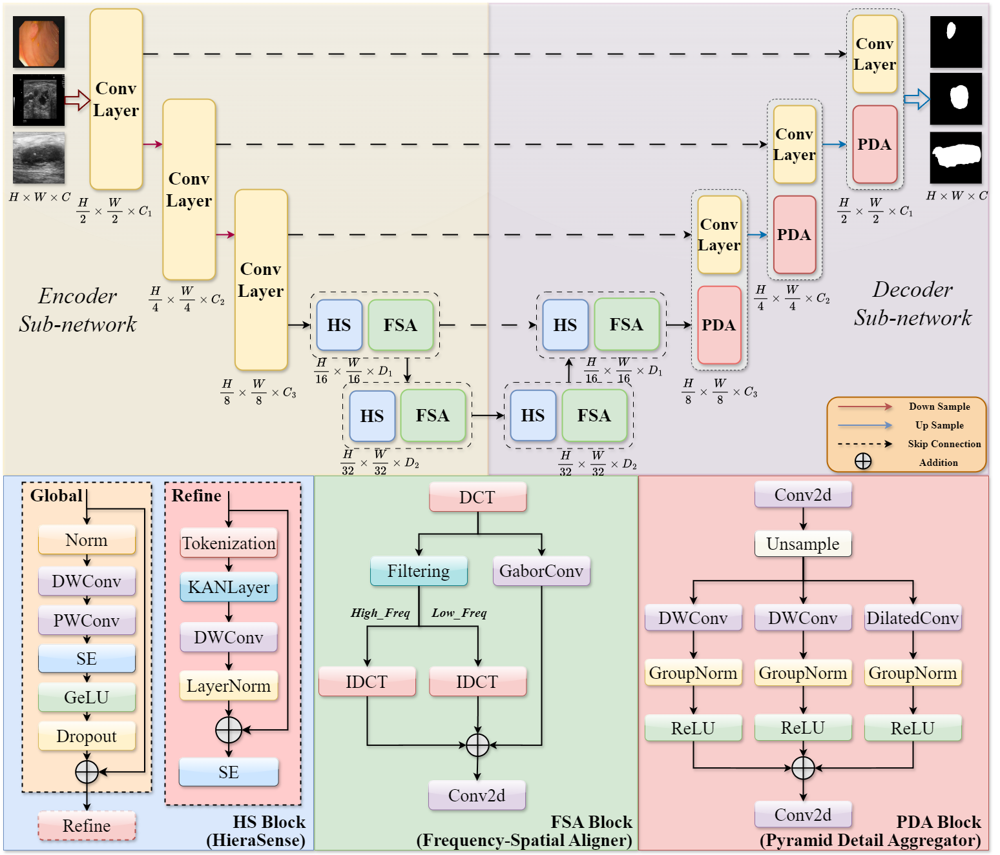

# FC-Net: Frequency-spatial Corporation Network for Robust Medical Image Segmentation
  [](LICENSE)</p>
  [](https://pytorch.org/)  
This repository provides supplementary materials for our preprint:  
**FC-Net: Frequency–spatial Corporation Network for Robust Medical Image Segmentation**  
[📄 Paper PDF]

## 🔍 Key Features
- Hierarchical HieraSense (HS) block: Global-to-local modeling with KAN-based spline for local textures and long-range dependencies.
- Frequency-Spatial Aligner (FSA): Fuses DCT shape priors with Gabor edges for boundary precision.
- Pyramid Detail Aggregator (PDA): Multi-scale feature fusion for small lesion delineation.
- Achieves SOTA on 6 datasets (BUSI, CVC-ClinicDB, etc.) with only 13.09M params.

<p align="center">
  
  <br>Fig. 1: Overall architecture of FC-Net.
</p>


## 💻 Setup
Tested with PyTorch 2.0+, Python 3.8+.
```bash
git clone https://github.com/FC-Net.git
cd FC-Net
conda create -n fcnet python=3.8
conda activate fcnet
pip install -r requirements.txt
```
Tips: We test the framework using pytorch=1.13.0, and the CUDA compile version=11.6. Other versions should be also fine but not totally ensured.

## 📁 Data Preparation
Download datasets from official sources:
- BUSI: The dataset can be found [here](https://scholar.cu.edu.eg/?q=afahmy/pages/dataset).
- GLAS: The dataset can be found [here](https://academictorrents.com/details/208814dd113c2b0a242e74e832ccac28fcff74e5).
- CVC-ClinicDB: The dataset can be found [here](https://polyp.grand-challenge.org/CVCClinicDB/).
- DDTI: The dataset can be found [here](https://drive.google.com/file/d/1wwlsEhwfSyvQsJBRjeDLhUjqZh8eaH2R/view).
- FUSC2021: The dataset can be found [here](https://fusc.grand-challenge.org/FUSeg-2021/).
- PH2: The dataset can be found [here](https://www.kaggle.com/datasets/athina123/ph2dataset).

The data file structure is as follows.
```
data
├── inputs
│   ├── BUSI
│     ├── images
|     ├── masks
│   ├── GLAS
│     ├── images
|     ├── masks
│   ├── CVC-ClinicDB
│     ├── images
|     ├── masks
│   ├── DDTI
│     ├── images
|     ├── masks
│   ├── FUSC
│     ├── images
|     ├── masks
│   ├── PH2
│     ├── images
|     ├── masks
```
## 📊 Model Zoo
|Method| Dataset | IoU (%) ↑ | DSC (%) ↑  | Checkpoints |
|-----|------|-----|-----|-----|
|FC-Net| BUSI | 73.14 | 84.31 | Coming Soon 🔒 |
|FC-Net| GLAS | 89.06 | 94.24 | Coming Soon 🔒 |
|FC-Net| CVC-ClinicDB | 89.74 | 94.55 | Coming Soon 🔒 |
|FC-Net| DDTI | 75.76 | 86.13 | Coming Soon 🔒 |
|FC-Net| FUSC2021 | 84.25 | 91.31 | Coming Soon 🔒 |
|FC-Net| PH2 | 85.61 | 92.19 | Coming Soon 🔒 |

## ✅ TODO List
- [ ] Release code for FC-Net 💻.
- [ ] Upload the checkpoints 📦.

## 🙏 Acknowledgements
Inspired by [U-KAN](https://github.com/CUHK-AIM-Group/U-KAN). Thanks to the medical imaging community! 🌟
